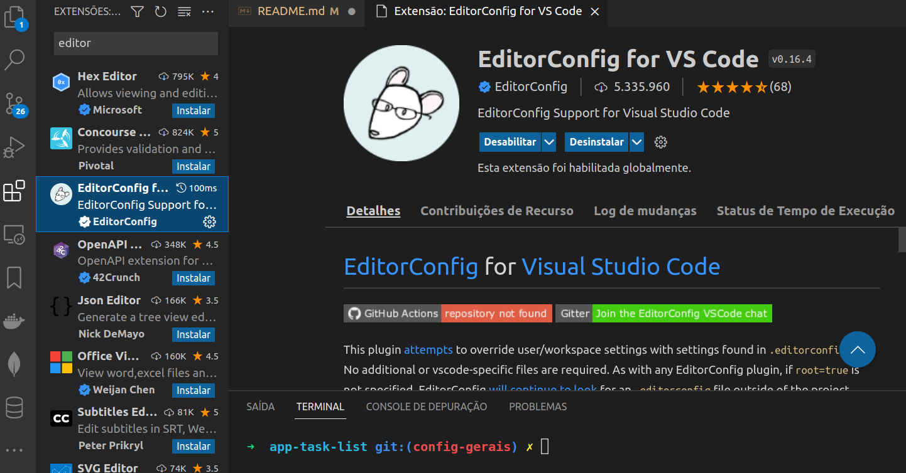

## Projeto: App List Task

### O que é App List Task?
> Um projeto proposto pelo time de carreira da trybe, que visa dar um feedBack profissional a cada participante dessa proposta, de forma termos esse atividade como termômetro para nossa jornada de sucesso como pessoas desenvolvedoras.

#### Contexto do projeto:
>A empresa Ebytr está passando por problemas de produtividade/controle porque as pessoas colaboradoras vêm tendo dificuldade na organização de suas tarefas individuais. Por esse motivo, a diretora de produto Carolina Bigonha decidiu implantar uma nova forma de organizar as tarefas.
Você foi a pessoa contratada para desenvolver um sistema capaz de auxiliar as pessoas colaboradoras a se organizar e ter mais produtividade. 

### Stacks que serão utilizadas pelo time de desenvolvimento:
- [x] - Stack MySQL;
- [x] - Express;
- [x] - React;
- [x] - Node.

### Bibliotecas auxiliares utilizadas no desenvolvimento:
- [x] - git-commit-msg-linter 4.1.3
 ```console
    npm install git-commit-msg-linter --save-dev
  ```

##### Observação Importante: 
>Foi combinado com a Ebytr que você utilizará essa mesma Stack para resolver o problema de organização e produtividade da empresa.

### Abaixo temos:
- [x] - Requisitos técnicos;
- [x] - Funcionalidades;
- [x] - Critérios de avaliação do desafio;
- [x] - Por fim dicas importantes.

#### Requisitos técnicos:
- [x] -Front-End em React;
- [x] - Back-End NodeJS;
- [x] - Gerenciador de Banco de Dados MySQL;

#### Funcionalidades:
- [x] - Visualizar a lista de tarefas;
>  Esta lista deve ser ordenável por ordem alfabética, data de criação ou por status;
- [x] - Inserir uma nova tarefa na lista;
- [x] - Remover uma tarefa da lista;
- [x] - Atualizar uma tarefa da lista;
- [x] - A tarefa deve possuir um status editável: pendente, em andamento ou pronto;

#### Critérios de avaliação
- [x] - Atendimento aos requisitos técnicos e funcionais;
- [x] - Seu projeto deve rodar sem erros;
- [x] - Entendimento dos conceitos das camadas adotadas;
Código e componentes reutilizados;
- [x] - Habilidade em escrever testes (mínimo 30% de cobertura);
- [x] - Boa legibilidade do código;
- [x] - Separação do front e backend;
- [x] - Mensagens de commits bem descritas e commits com um escopo nítido;
- [x] - Referências de códigos de terceiros;
- [x] - Instruções nítidas no README do projeto para setup e  execução da aplicação e dos testes.
#### Dicas importantes!
- [x] - Ter uma boa cobertura de testes Front e Back;
- [x] - Aplicar boas práticas de escrita de código;
> Documentação do projeto (README), que inclua:
> Passo a passo para instalar e executar o projeto. Incluindo instruções especiais para instalar dependências e/ou bancos de dados, se houver;
> Endereço da aplicação no Heroku, se houver (ou outro serviço de deployment);
- [x] - Ter um linter configurado;
- [x] - O projeto deverá ser entregue via repositório pessoal no GitHub (utilize boas práticas de criação/nomeação de branches, além de mensagens de commits bem descritas e commits com um escopo nítido).


### 1 - Setup inicial da aplicação(Back-End):

- [x] - Criando a pasta Blitz;

```console
mkdir blitz-task-list-trybe
```

- [x] - Iniciando o git dentro da pasta blitz-task-list-trybe;

```console
git init
```

- [x] - Inicializando um arquivo json na raiz de blitz-task-list-trybe;

```console
npm init -y
```

- [x] - Instalar o git-commit-msg-linter 

```console
npm install git-commit-msg-linter --save-dev
```

- [x] - Fazendo commit das configuraçẽos iniciais básicas

```console
git add .
git commit -m""
git push -u origin master
```

##### Nota: significado das tags relacionadas ao commit-msg-linter

```console
type:
    feat     Adição de funcionalidade.
    fix      Correção de defeito.
    docs     Mudança em documentação.
    style    Mudança de formatação ou estilo, que não afeta a execução do código (espaço, tabulação, etc).
    refactor Mudança na organização do código, que não afeta o comportamento existente.
    test     Adição ou mudança de um teste.
    chore    Adição ou mudança em script de build, que não afeta o código de produção.
    perf     Mudança de código para melhoria de desempenho.
    ci       Mudança de configuração de integração contínua.
    build    Mudança em arquivos de build ou em dependências externas.
    temp     Commit temporário, que não deve ser incluído no CHANGELOG.

  scope:
    Opcional, pode ser qualquer coisa que especifique o escopo da mudança.
    Exemplos: subpacote, workspace, módulo, componente, página.

  subject:
    Breve resumo da mudança, escrito no tempo verbal presente. Começa com letra minúscula e não há ponto final.
```


- [x] - criando uma branch para configurações gerais:

```console
git checkout -b config-gerais
```

- [x] Criando uma Pastas back-list-task;

```console
mkdir back-list-task
```

- [x] - Entrando na pasta;

```console
cd back-list-task
```

- [x] - criar arquivo json padrão;

  ```console
    npm init -y
  ```

##### Nota: alguns comandos git util no desenvolvimento:

```console
git status
git add .
git commit -m""
git push
git push -u origin nome_branch
git pull
git log 
git log --oneline
git tag "nome_tag" -m"" 
git tag -a "nome_tag" -m"" id
```


###  Ferramentas e pacotes que utilizaremos no desenvolvimento da aplicação back-end:

- [x] - FrameWork Express ;
- [x] - nodemom;
- [x] - Mysql2;
- [x] - MySQL Workbench (Ferramenta Gráfica);
- [x] - Sequelize CLI;
- [x] - Sequelize 
- [x] - Cors 
- [x] - mocha ^9.2.2;
- [x] - chai: ^4.3.6; 
- [x] - sinon: ^13.0.1
- [x] - "coverage-node": "^6.1.0",

### Instalando Dependências:

> Todos os comando abaixo deverão ser utilizado dentro da pasta back-end.

- [x] - npm i express;
- [Link Express ](https://www.npmjs.com/package/express)

- [x] - npm install -D nodemon;
- [Link Pacote npm Nodemon ](https://duckduckgo.com)

  > Obs.: O D MAIÚSCULO é informa que é uma forma contraída de dizer que é uma Dependência de 
  > Desenvolvimento, ou seja, na hora de subir para a produção essa dependência não tem importancia para 
  > o bom funcionamento da minha aplicação, essa dependencia é somente para testes no momento do 
  > desenvolvimento.

- [x] - npm install mysql2
 > Client Utilizado para fazer a conexão de uma palicação Node Com Mysql (connector);

- [x] - npm install sequelize-cli;
- [Link Pacote npm Sequelize-Cli ](https://www.npmjs.com/package/sequelize-cli)

- [x] - npm i sequelize;
- [Link Sequelize ](https://www.npmjs.com/package/sequelize)

- [x] - npm i cors;
- [Link Cors ](https://www.npmjs.com/package/cors)
> o cors ele não é dependência de desenvolvimento, pois, em ambiente de produção ele deve constar na aplicação para fazer a conexão entre back e front.


- [x] - npm i dotenv
 - [Link dotEnv ](https://www.npmjs.com/package/dotenv)

- [x] - npm i body-parser
  > Middleware de análise do corpo do Node.js.
  > Analise os corpos de solicitação de entrada em um middleware antes de seus manipuladores,
  > disponíveis na propriedade req.body.
- [Body-Parse](https://www.npmjs.com/package/body-parser)

- [x] - npm i http-status-codes (OPCIONAL)
  > códigos de status http constantes enumerando os códigos de status HTTP.
  > Baseado na API Java Apache HttpStatus.
  - [status-codes](https://www.npmjs.com/package/http-status-codes)

- [x] - npm install eslint --save-dev
- [Dica de instalação EsLint](https://www.npmjs.com/package/sinon)
- [Canal do Youtube com Dica Configuração](https://www.youtube.com/watch?v=mj4V_GkGmv4)

##### Configurando esLint back-end:

```console
npm init @eslint/config

? How would you like to use ESLint? … 
  To check syntax only
  To check syntax and find problems
▸ To check syntax, find problems, and enforce code style

✔ How would you like to use ESLint? · style

? What type of modules does your project use? … 
  JavaScript modules (import/export)
▸ CommonJS (require/exports)
  None of these

✔ How would you like to use ESLint? · style
✔ What type of modules does your project use? · commonjs

? Which framework does your project use? … 
  React
  Vue.js
▸ None of these

✔ How would you like to use ESLint? · style
✔ What type of modules does your project use? · commonjs
✔ Which framework does your project use? · none

? Does your project use TypeScript? ‣ No / Yes

? Where does your code run? …  (Press <space> to select, <a> to toggle all, <i> to invert selection)
✔   Browser
✔ ▸ Node

? How would you like to define a style for your project? … 
▸ Use a popular style guide
  Answer questions about your style

? Which style guide do you want to follow? … 
▸ Airbnb: https://github.com/airbnb/javascript
  Standard: https://github.com/standard/standard
  Google: https://github.com/google/eslint-config-google
  XO: https://github.com/xojs/eslint-config-xo

? What format do you want your config file to be in? … 
▸ JavaScript
  YAML
  JSON

eslint-config-airbnb-base@latest eslint@^7.32.0 || ^8.2.0 eslint-plugin-import@^2.25.2
? Would you like to install them now?  No / ‣ Yes

? Which package manager do you want to use? … 
▸ npm
  yarn
  pnpm


```

- [x] - npm install --save-dev chai
- [Link pacote npm Chai](https://www.npmjs.com/package/chai)

- [x] - npm install --save-dev mocha
- [Link pacote npm Mocha](https://www.npmjs.com/package/mocha)

- [x] - npm i --save-dev sinon 
- [Link Pacote npm Sinon](https://www.npmjs.com/package/sinon)

- [x] - npm install coverage-node --save-dev
- [Link Pacote npm Sinon](https://www.npmjs.com/package/coverage-node)


### Package.json, configurações back-end (Sripts):
 > Configurando o scrip que inicializar nossa aplicação, o arquivo principal da nossa aplicação será server.js

 ```javascritp
"scripts": {
    "start": "nodemon server.js"
  },
 ```

### Criando a estrutura Base de Pasta do Projeto:

```console

|back-end|
    |
    |---------> |node_modules|
    |
    |---------> |src| 
                  |
                  |-------->|controllers|
                  |
                  |---------->|database|
                  |               |
                  |               |----------------->|config|
                  |               |
                  |               |----------------->|migrations|
                  |               |
                  |               |----------------->|models|
                  |               |
                  |               |----------------->|seedrs|
                  |
                  |-------->|middlewares|
                  |
                  |-------->|routes|
                  |
                  |-------->|services|
                  |             | 
                  |             |---------------------->|login|
                  |             |
                  |             |---------------------->|reserve|
                  |
                  |--------> |utils|

```

### Setup inicial ambiente do Front-End:

- [x] Iremos criar o app utilizando npx create;

###### Nota: dentro da pastas blitz-task-list-trybe utilizar o comando abaixo para inicializar um projeto react.

```console
npx create-react-app app-task-list
```


### Ferramentas e pacotes que utilizaremos no desenvolvimento da aplicação(Front-End):


- [x] - axios: ^0.26.1 ;
- [Link Pacote axios ](https://www.npmjs.com/package/axios)

```console
 npm install axios
```

- [x] - instalando nodemon;
- [Link Pacote nodemon](https://www.npmjs.com/package/nodemon)

```console
 npm install -D nodemon
```

- [x] - bootstrap: ^5.1.3;
  - [Link Pacote bootstrap ](https://www.npmjs.com/package/bootstrap)
  
> Para integrarmos o BootStrap a minha aplicaçao primeiro devemos fazer a instalação da biblioteca 
> bootstrap na aplicação, pois, o reactstrap não inclui o bootstrap(video: a partir de 2min 05s):

```console
npm install --save bootstrap
```
Logo em Seguida instalar o reactstrap(video: a partir 2min 38s ):

```console
npm install --save reactstrap react react-dom
```

> Depois precisamos fazer uma importação do bootstrap.mim no arquivo index.js dentro da pastas src:

```console
|font-end|
    |
    |---------------->|app-reserva|
                            |
                            |--------------->|src|
                                               |
                                               |--------> Arquivo: >> index.js <<
```

> Conteúdo index.js

```console
import React from 'react';
import ReactDOM from 'react-dom/client';
import 'bootstrap/dist/css/bootstrap.min.css';
import './index.css';
import App from './App';

const root = ReactDOM.createRoot(document.getElementById('root'));
root.render(<App />);

```

- [Tutorial com integrar o Framework React com a biblioteca bootsrtap](https://www.youtube.com/watch?v=90EGEu8tqY8)


- [x] - npm i react-router-dom@5.3.1;
  
```console
 npm i react-router-dom@5.3.1
```

- [Link Pacote react-router-dom ](https://www.npmjs.com/package/react-router-dom/v/5.3.0)

- [x] - React Toastify: ^5.1.3;
  
```console
 npm i react-toastify
```

> Uma lib que te por propósito tornar mais simples o processo de exibir notificações para o usuário.

- [Link Pacote reac-toastify ](https://www.npmjs.com/package/react-toastify)

- [Tutorial React-toastify](https://www.youtube.com/watch?v=gKXGndx1zu8)


### Configurando esLint front-end:

- [x] - Instalando o EsLint
- [Canal do Youtube Jorge Aluizio](https://www.youtube.com/watch?v=duKqKhtZmPA)

- [x] - Instalando o Editor Config VsCode Extension



- [x] - Em seguida gerar o arquivo .editorconfig na raiz da pasta front-end(app-task-list);


- [x] - inserir as configuraçẽos pré-definidas no arquivo padrão de configuração;

```console
# EditorConfig is awesome: https://EditorConfig.org

# top-most EditorConfig file
root = true

[*]
indent_style = space
indent_size = 2
end_of_line = lf
charset = utf-8
trim_trailing_whitespace = true
insert_final_newline = true
```

```console
npm i eslint -D
npx eslint --init

? How would you like to use ESLint? … 
  To check syntax only
▸ To check syntax and find problems
  To check syntax, find problems, and enforce code style

✔ How would you like to use ESLint? · style
? What type of modules does your project use? … 
▸ JavaScript modules (import/export)
  CommonJS (require/exports)

? Which framework does your project use? … 
▸ React
  Vue.js
  None of these

? Does your project use TypeScript? ‣ No / Yes

? Where does your code run? …  (Press <space> to select, <a> to toggle all, <i> to invert selection)
✔ Browser
✔ Node

? How would you like to define a style for your project? … 
▸ Use a popular style guide
  Answer questions about your style

  ? Which style guide do you want to follow? … 
▸ Airbnb: https://github.com/airbnb/javascript
  Standard: https://github.com/standard/standard
  Google: https://github.com/google/eslint-config-google
  XO: https://github.com/xojs/eslint-config-xo

  ? What format do you want your config file to be in? … 
▸ JavaScript
  YAML
  JSON


eslint-plugin-react@^7.28.0 eslint-config-airbnb@latest eslint@^7.32.0 || ^8.2.0 eslint-plugin-import@^2.25.3 eslint-plugin-jsx-a11y@^6.5.1 eslint-plugin-react-hooks@^4.3.0
? Would you like to install them now?  No / ‣ Yes

? Which package manager do you want to use? … 
▸ npm
  yarn
  pnpm

```

-[x] - Criado o arquivo .eslintrc.json que terá a seguinte estrutura de configuração:

```json
{
    "env": {
        "browser": true,
        "es2021": true
    },
    "settings": {
        "react":{
            "version":"detect"        
        }
    },
    "extends": [
        "eslint:recommended",
        "plugin:react/recommended",
        "plugin:react-hooks/recommended",
        "plugin:prettier/recommended"

    ],
    "parserOptions": {
        "ecmaFeatures": {
            "jsx": true
        },
        "ecmaVersion": "latest",
        "sourceType": "module"
    },
    "plugins": [
        "react",
        "prettier"
    ],
    "rules": {
        "react/prop-types":"off",
        "react/react-in-jsx-scope":"off",
        "@typescript-eslint/explicit-modules-boudary-types":"off"
    
    }

}

```

- [x] - Instalando o eslint-plugin-react 
- [Link Pacote npm ](https://www.npmjs.com/package/eslint-plugin-react)

```console
npm install eslint eslint-plugin-react --save-dev
```

- [x] - Instalando plugin eslint-plugin-react-hooks

```console
npm install eslint-plugin-react-hooks --save-dev
```
[Link Pacote](https://www.npmjs.com/package/eslint-plugin-react-hooks)

- [x] - Criar uma arquivo .eslintignore;

```console
node_modules/
dist
build
```

- [x] - Instalando o Prettier no projeto;

```console
npm install --save-dev --save-exact prettier
```
- [x] - Em seguida, crie um arquivo de configuração vazio para que os editores e outras ferramentas saibam que você está usando o Prettier:
> Nota: dentro da plasta app-task-list rode esse comando no terminal do VsCode

```console
echo {}> .prettierrc.json
```
> Observação: Adicione as configurações abaixo no arquivo prettierrc.json criado:

```json
{

    "semi":true,
    "trailingComma":"all",
    "singleQuote":true,
    "printWidth":100,
    "arrowParens":"avoid"
}


```

- [x] - Criando um arquivo .prettierignore, e adicionando o seguinte conteúdo ao documento:

```json
node_modules/
build
dist
```

- [x] - Instalando plugin eslint-plugin-prettier
[Link Pacote](https://www.npmjs.com/package/eslint-plugin-prettier)

```console
npm install --save-dev eslint-plugin-prettier
```

- [x] - Instalando plugin eslint-config-prettier
[Link Pacote](https://www.npmjs.com/package/eslint-config-prettierr)

```console
npm install --save-dev eslint-config-prettier -D
```
- [x] - Criando um pasta na raiz do projeto app-task-list e adicionando uma arquivo settings.json;

```console
touch .vscode
cd .vscode
touch settings.json
```
> Nota: Conteúdo do arquivo:

```json
{
    "editor.formatOnSave": false,
    "editor.codeActionsOnSave": {
        "source.fixAll.eslint": true
    }
}
```


##### Nota: Sobre o git dentro da pasta app-task-lis:

> Quando criamos o projeto utilizando o npx create-react-app, por padrão 
> ele acopla automaticamente no projeto o git, porém, como iremos controlar 
> todo versionamento do código a partir de branchs prontas para entrega, faremos
> todo esse processo em um único lugar no caso dentro da pasta blitz-task-list, por esse motivo
> iremos apagar o git e o arquivo .gitignore da pasta frront-end

```console
cd app-task-list
rm -rf .git .gitignore
```
